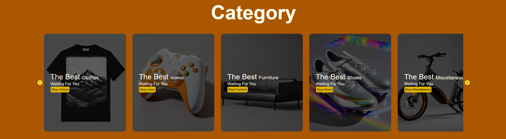
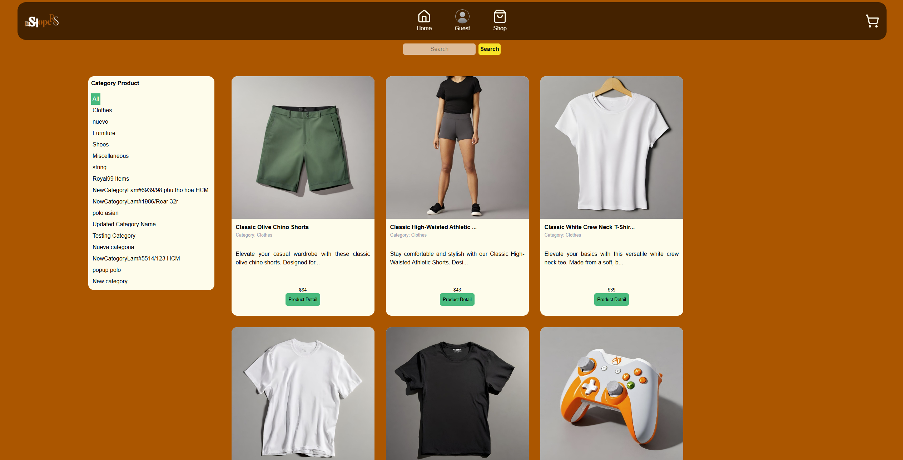
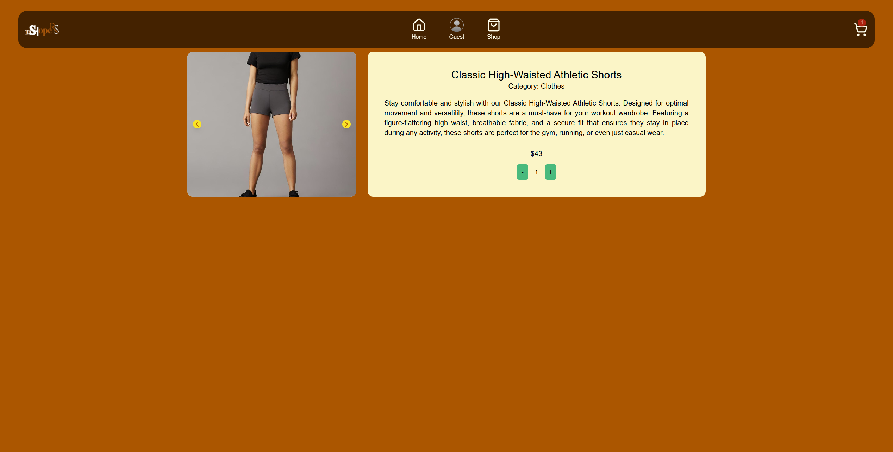
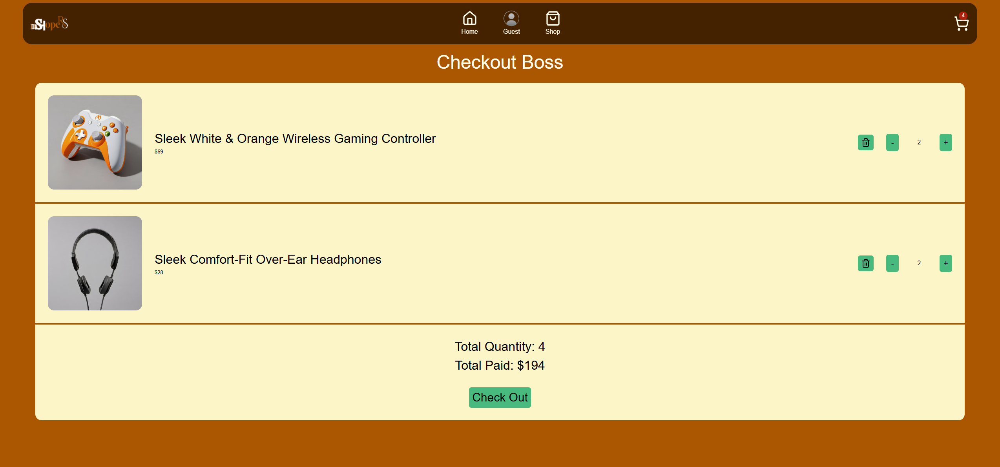
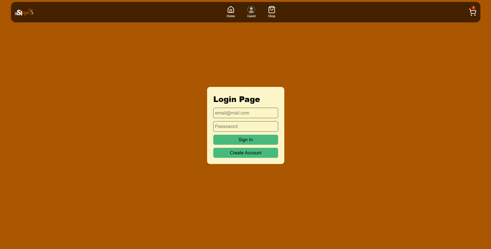
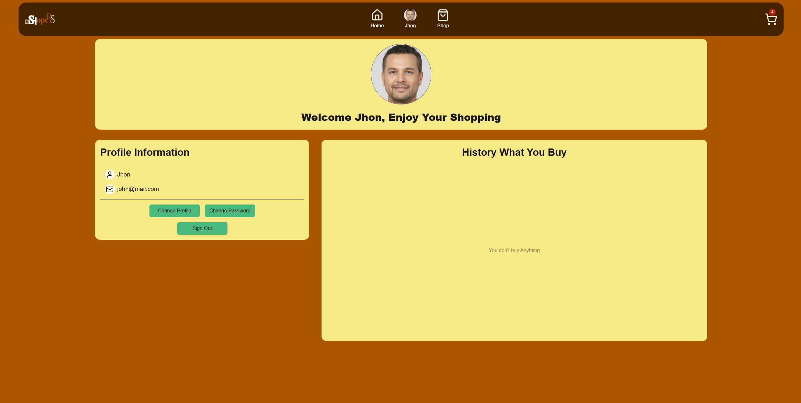
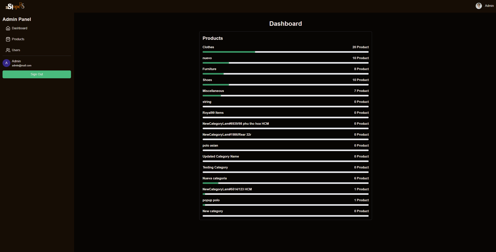
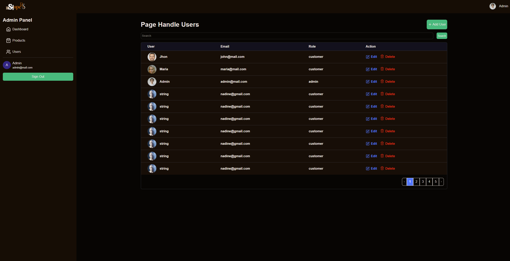

# Milestone-3

## Overview
This is a modern e-commerce website built with **Next.js** that allows users to easily browse, search, and filter products by categories. Users can view detailed information about each product and manage their shopping cart by adding or removing items with a smooth and responsive user experience while admins manage product inventory and user profiles via a protected dashboard (middleware).

## Features Implemented
### 🧭 Public Features
- Homepage with category highlights
- Product listing with search and pagination
- Product detail page
- Shopping cart with quantity update
- Checkout page

### 🔐 Authentication – NextAuth.js
- Credential-based login (email + password)
- Role-based redirect:
  - `Customer` → `/profile`
  - `Admin` → `/dashboard`
- Session stored in cookies

### 👨‍💼 Admin Features
- Add, delete, and edit **products**
- View and edit **users**
- Admin-only access via middleware

### 👤 Customer Profile
- View personal info (email & name)
- Update profile data and change password
- Access restricted to `role: customer`

### 🛒 Shopping Cart
- Add/remove items
- Quantity update
- Stored in localStorage using Context API

---

## Technologies Used
- 🧩 **Next.js** (App Router)
- 🛠️ **TypeScript**
- 🎨 **Tailwind CSS**
- 🔐 **NextAuth.js** (Credential provider)
- 💾 **Fetch API** (external REST API)
- 🧠 **Context API** for cart state

## 🔐 Roles & Redirect Flow

| Role     | After Login Redirect | Access to Dashboard | Access to Profile |
|----------|----------------------|----------------------|-------------------|
| Customer | `/profile`           | ❌                   | ✅                |
| Admin    | `/dashboard`         | ✅                   | ❌                |

## 🧪 Test Demo Accounts

### Admin
Email: admin@example.com <br>
Password: admin123
### Customer
Email: john@mail.com <br>
Password: changeme
### You Can Get For Other Users at:
Link api: https://api.escuelajs.co/api/v1/users 

## 🖼️ Screenshots

| Page                         | Preview                                                 |
|------------------------------|----------------------------------------------------------|
| Home Page                    |                        |
| Shop Page                    |                       |
| Product Detail Page          |             |
| Checkout Page                |                  |
| Login Page                   |                     |
| Profile Page (Customer)      |          |
| Admin Dashboard              |                  |
| Admin - Product Management   |             |
| Admin - User Management      |           |

## Demo

**Live Demo:** [deShopper](https://e-commerce-project-with-next.vercel.app/)

## 🧑‍💻 Getting Started

```bash
git clone https://github.com/revou-fsse-feb25/milestone-3-Salthof28.git
cd milestone-3
npm install
npm run dev
```

## Author
🔧 Salman Althof

